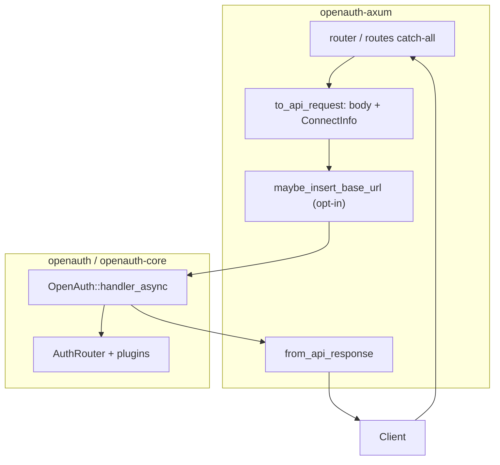

# Resumen: `openauth-axum`

## Qué es este crate

`openauth-axum` es un **adaptador delgado** entre Axum 0.8 y el núcleo HTTP
framework-neutral de OpenAuth (`OpenAuth::handler_async`). No implementa reglas de
negocio de autenticación; solo:

1. Monta un router catch-all bajo `OpenAuthOptions::base_path` (default `/api/auth`).
2. Convierte `axum::http::Request<Body>` → `openauth::ApiRequest<Vec<u8>>`.
3. Invoca el handler del core.
4. Convierte `openauth::ApiResponse` → `axum::response::Response`.

## Analogía con Better Auth (no es Next.js)

En Better Auth, **Next.js no es el núcleo**: el núcleo es `auth.handler(Request)` sobre
la Web Fetch API. Los frameworks solo **acoplan** ese handler:

| Framework | Montaje típico | Capa de conversión |
| --- | --- | --- |
| **Hono** | `auth.handler(c.req.raw)` | Ninguna (ya es `Request`) |
| **Next App Router** | `toNextJsHandler(auth)` → `{ GET, POST, … }` | Ninguna + plugin `nextCookies` |
| **Express** | `toNodeHandler(auth)` | `better-call/node` (`IncomingMessage` → `Request`) |
| **Axum (OpenAuth)** | `router(auth)?` o `into_router()` | Buffer body, `ConnectInfo`, base URL opcional |

`openauth-axum` es conceptualmente el hermano Rust de **Hono + un poco de Node adapter**:
el request ya es HTTP nativo, pero Rust/Axum exige materializar el body y puede exponer
metadata de conexión distinta a Node.

## Flujo de datos

## División de responsabilidades vs upstream

| Responsabilidad | Dónde está en Better Auth 1.6.9 | Dónde está en OpenAuth |
| --- | --- | --- |
| Tabla de rutas `/sign-in/email`, plugins, etc. | `better-auth` → `api/index.ts` + `better-call` router | `openauth-core` `AuthRouter` |
| Resolver `baseURL` / trusted origins por request | `auth/base.ts` + `utils/url.ts` | Core + extensión `RequestBaseUrl` insertada por **axum** si se habilita inferencia |
| Montar path `/api/auth/*` | Implícito en handler (`basePath`) | Explícito: `Router::nest` + validación `base_path` |
| Límite tamaño body | Depende del host (Next/Express middleware) | **Adaptador** (`OpenAuthAxumOptions::body_limit`) |
| Cookies en Server Components | `nextCookies` plugin | **No aplica** (respuestas HTTP estándar) |
| Errores 500 del handler | Framework / better-call | JSON sanitizado en adaptador |

## Alcance de esta documentación

| Incluido | Excluido |
| --- | --- |
| API pública del adaptador | Cliente TS / `better-auth/client` |
| Opciones `OpenAuthAxumOptions` | SDK React, Expo, etc. |
| Tests del crate y su relación con upstream | Paridad completa de todos los endpoints (ver `openauth`, `openauth-core`) |
| Comparación con `integrations/*` y `better-call/node` | Implementación interna del core salvo puntos de acoplamiento |

## Tamaño del adaptador

| Métrica | Valor (2026-06-01) |
| --- | --- |
| Módulos `src/` | `lib`, `router`, `request`, `response`, `options`, `error` |
| LOC `src/` | ~543 |
| LOC tests + `tests/common` | ~2 450 |
| Dependencias runtime | `axum`, `openauth`, `http-body-util`, `serde_json`, `thiserror` |

## Conclusión ejecutiva

- **Paridad de montaje HTTP:** alta respecto al patrón “passthrough handler” (Hono / `toNextJsHandler`).
- **Superset en adaptador:** límite de body, validación de `base_path` para Axum, `ConnectInfo`, flags explícitos de proxy/base URL, errores JSON del adaptador.
- **Huecos esperados (diseño):** sin plugins de cookies de Next/Svelte/TanStack; sin `toNodeHandler` (otro stack).
- **Tests:** OpenAuth concentra aquí muchos flujos E2E que upstream prueba en suites generales de `better-auth`, no en `integrations/`.

Siguiente lectura: [02-package-mapping.md](./02-package-mapping.md), [05-tests.md](./05-tests.md).
