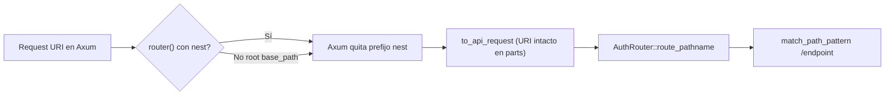

# Rutas, montaje y footguns (auditoría código)

Hallazgos de una segunda pasada sobre `router.rs`, `openauth-core` `path.rs`, docs upstream y ejemplos del repo.

## Cómo llega el path al core



`openauth-core` (`api/path.rs` → `route_pathname`):

- Si el pathname **empieza por** `{base_path}/`, lo quita y deja `/sign-in/email`, etc.
- Si el pathname **no** incluye el prefijo (p. ej. solo `/ok`), se usa tal cual.
- Con `skip_trailing_slashes`, entra `normalize_pathname` (testeado en `routing.rs`).

**Consecuencia:** con `base_path = /api/auth` y `router()`:

| URI en el request | ¿Funciona? | Notas |
| --- | --- | --- |
| `/api/auth/ok` | Sí | Tests `oneshot` usan path completo |
| `/ok` tras nest interno | Sí | Axum pasa path relativo al nested router |
| `/ok` en app **sin** nest (solo `into_routes` mal anidado) | Puede 404 en Axum | El nest es responsabilidad del compose |

No hay test que envíe **solo** `/ok` contra `router()` con default `/api/auth` (sin `base_path("/")`); el caso root sí usa `/ok` en `root_base_path_mounts_*`.

## `base_path` vs `base_url` (divergencia de upstream)

| | Better Auth 1.6.9 | OpenAuth |
| --- | --- | --- |
| Path del router HTTP | `basePath = new URL(ctx.baseURL).pathname` en `api/index.ts` | `OpenAuthOptions::base_path` (default `/api/auth`), **independiente** de `base_url` |
| Montaje Axum | N/A | `router()` hace `nest` en `context().base_path` |

**Footgun:** `base_url("https://app.com/custom")` + `base_path("/api/auth")` sin alinear pathname puede generar redirects/callbacks incoherentes. Upstream fuerza coherencia derivando el path del URL. **Mitigación:** configurar ambos de forma consistente; usar inferencia solo con flags explícitos.

## Upstream handler vs adaptador Axum (base URL)

| Comportamiento | `auth/base.ts` | `openauth-axum` |
| --- | --- | --- |
| Sin `baseURL` en config | Deriva en **primer** request; puede mutar `ctx` compartido | **No** muta contexto; opt-in `infer_base_url_from_request` → extensions por request |
| Sin base URL resoluble | `BetterAuthError` | `base_url` vacío en contexto si no se configuró ni inferencia |
| `isDynamicBaseURLConfig` | `resolveRequestContext` por request | **No portado** |
| `trustedOrigins` / providers | `getTrustedOrigins(..., request)` en handler | `AuthContext::trusted_origins_for_request` en core (no en adaptador) |

## Analogía docs upstream (integraciones)

| Doc | Montaje | Métodos HTTP en ejemplo | OpenAuth Axum |
| --- | --- | --- | --- |
| [Hono](https://github.com/better-auth/better-auth/blob/v1.6.9/docs/content/docs/integrations/hono.mdx) | `auth.handler(c.req.raw)` en `/api/auth/*` | Solo **GET, POST** en snippet | `any()` → **todos** los métodos que envíe el cliente |
| [Next App Router](https://github.com/better-auth/better-auth/blob/v1.6.9/docs/content/docs/integrations/next.mdx) | `toNextJsHandler` | Ejemplo exporta solo **GET, POST**; implementación tiene PATCH/PUT/DELETE | `any()` (más amplio que el snippet Next) |
| [Express](https://github.com/better-auth/better-auth/blob/v1.6.9/docs/content/docs/integrations/express.mdx) | `toNodeHandler(auth)` | `app.all` (todos) | `router()` catch-all |

**Footgun Express (traducible a Axum):** no aplicar `express.json()` **antes** del handler Better Auth. En Axum: no consumir/parsear el body en middleware Tower **antes** de `openauth-axum` (el adaptador debe ser quien bufferiza con `to_bytes`). Middleware que robe el body rompe el core.

## Duplicación `is_loopback_host`

| Ubicación | Uso |
| --- | --- |
| `openauth-axum/src/router.rs` | `host_header_origin` → `http` vs `https` en inferencia |
| `openauth-core/src/utils/host.rs` | `is_loopback_host`, SSRF, trusted origins |

La lógica del adaptador es **copia local** (IPv6 brackets, `127.*`, `.localhost`), no llama al helper del core. **Riesgo:** drift si se endurece loopback en core y no en axum. **Sin test** de `.localhost` / `::1` en inferencia en este crate.

## API `handle(auth: &OpenAuth, …)`

```rust
pub async fn handle(auth: &OpenAuth, request: Request<Body>) -> ...
```

Evita mover `OpenAuth` en cada request cuando el estado ya vive en `Arc` (p. ej. `State` de Axum).

Toma `OpenAuth` **owned** pero solo llama `handle_ref(&auth, …)`. Obliga a mover/clonar en cada request si se usa esta firma; preferir `handle_ref` / state en `Router`. **Sin tests** de `handle` / `handle_with_options`.

## CLI vs ejemplos

| Fuente | Patrón recomendado |
| --- | --- |
| `openauth-cli` `init` (framework axum) | `openauth_axum::router(auth)?` + `into_make_service_with_connect_info` |
| `examples/full-app` | `auth.into_routes()` + `.nest(AUTH_BASE_PATH, …)` |
| `examples/stripe-smoke-server` | Igual que full-app + `ConnectInfo` documentado |

No es bug: `router()` es azúcar sobre `nest(base_path, routes())`. La CLI podría mencionar `into_routes` para apps con router estático propio.

## Tests que siguen faltando (nueva lista)

| Escenario | Severidad |
| --- | --- |
| `disabled_paths` vía montaje Axum | Media |
| Plugin `on_request` mutando request vía Axum | Media |
| Inferencia con URI absoluta `https://host/api/auth/...` | Baja |
| Host malicioso estilo `url.test.ts` (null, `javascript:`, etc.) | Media |
| Path `/ok` con `router()` default nest (solo path relativo al nested service) | Baja |
| Alineación `is_loopback` adapter vs `openauth_core::utils::host` | Baja (diseño) |

## `handle_async_server` / rutas `server_only`

El core expone `AuthRouter::handle_async_server` para entradas no expuestas a Internet. **No** hay wrapper en `openauth-axum`; las apps deben llamar al core directamente o montar otra ruta Axum que invoque esa API. Mismo rol que invocar `auth.api` en servidor en Better Auth sin pasar por el catch-all público.
