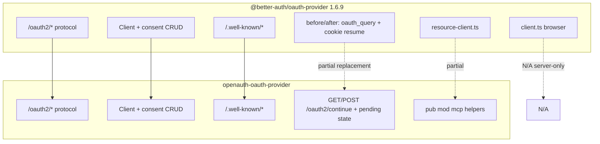

# 01 — Executive summary

## What each side is

| | Better Auth `@better-auth/oauth-provider` | OpenAuth `openauth-oauth-provider` |
| --- | --- | --- |
| Purpose | Plugin that turns Better Auth into an OAuth 2.1 / OIDC **authorization server** | Same role in `OpenAuth` via `oauth_provider()` |
| Mounting | Routes under `basePath` (e.g. `/api/auth`) + schema merge + global hooks | `AuthPlugin` in `openauth-core` + registered endpoints |
| Product status | Stable in the BA ecosystem | Experimental beta (see crate README) |
| Upstream tests | 18 files, **261** `it` cases | **96** integration tests |

## Scope of this documentation

**Included**

- HTTP behavior of the authorization server (endpoints under `/oauth2/*`, `/.well-known/*`, `/admin/oauth2/*`).
- Persistent models (`oauthClient`, opaque tokens, consents, codes in `verification`).
- Configuration options and defaults aligned with upstream.
- Tests: which upstream scenario each Rust test covers and what is missing.
- **Server-only** decisions (no port of `client.ts` or resource-client SDK).

**Excluded (not counted as a parity gap for this crate)**

- `@better-auth/oauth-provider/client` (browser injection of `oauth_query`).
- `@better-auth/oauth-provider/resource-client` as a TypeScript **client** (partial server helpers in Rust `mcp`).
- Vitest, `tsdown`, OpenAPI `createAuthEndpoint` as a product.
- E2E with Generic OAuth, organization plugin, `listhen`, MCP SDK (except behavior already exposed over HTTP).

## Parity mental model

## One-table conclusion

| Category | Upstream | OpenAuth |
| --- | --- | --- |
| Production HTTP endpoints | 25 | 26 (dual method on `/oauth2/continue`) |
| Plugin DB models | 4 (`oauthClient`, refresh, access, consent) | 4 tables (`oauth_*` plural snake_case) |
| npm subpath exports | 3 (`.`, `/client`, `/resource-client`) | 1 crate; `pub mod mcp` |
| Supported grants | `authorization_code`, `client_credentials`, `refresh_token` | Same |
| Automated tests | 261 `it` | 96 Rust tests |
| Estimated server functional parity | — | **High** on endpoints/grants; see [08-parity-closeout-2026-06.md](./08-parity-closeout-2026-06.md) |

## Where logic lives

| Concern | Upstream | OpenAuth |
| --- | --- | --- |
| Plugin assembly | `src/oauth.ts` | `src/lib.rs` (`oauth_provider`) |
| Authorize | `src/authorize.ts` | `src/endpoints/authorization.rs`, `src/authorize.rs` |
| Consent / continue | `src/consent.ts`, `src/continue.ts` | `src/endpoints/consent.rs`, `src/consent.rs` |
| Token | `src/token.ts` | `src/endpoints/token.rs`, `src/token/*` |
| Introspect / revoke | `src/introspect.ts`, `src/revoke.ts` | `src/endpoints/introspection.rs`, `src/token/introspection.rs` |
| Userinfo / logout | `src/userinfo.ts`, `src/logout.ts` | `src/endpoints/userinfo.rs`, `logout.rs` |
| Metadata | `src/metadata.ts` | `src/metadata.rs`, `endpoints/metadata.rs` |
| DCR / clients | `src/register.ts`, `src/oauthClient/*` | `src/client.rs`, `endpoints/clients.rs` |
| Consent API | `src/oauthConsent/*` | `endpoints/consent.rs`, `consent.rs` |
| MCP / resource | `src/mcp.ts`, `src/client-resource.ts` | `src/mcp.rs` (no HTTP) |
| URL validation | `src/types/zod.ts` | `client.rs` + redirect tests |
| OAuth state on request | `defineRequestState` in `oauth.ts` | Pending authorization in `verification` + signed query |

## Next documents

- Endpoint detail: [03-endpoints.md](./03-endpoints.md)
- Why we do not port the browser client: [05-design-decisions.md](./05-design-decisions.md)
- Test matrix: [06-tests.md](./06-tests.md)
