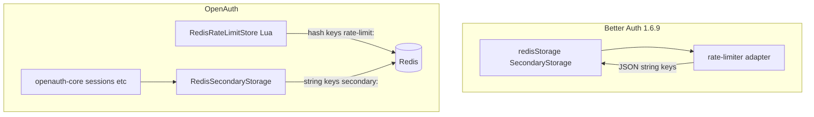

# 04 — Rate limiting y Redis

Esta es la **mayor divergencia arquitectónica** respecto a `@better-auth/redis-storage`.

## Upstream: un solo almacén KV

1. El usuario configura `secondaryStorage: redisStorage({ client })`.
2. En `create-context.ts`, si hay `secondaryStorage` y no se override `rateLimit.storage`, el default es `"secondary-storage"`.
3. El rate limiter (`packages/better-auth/src/api/rate-limiter/index.ts`) adapta:
   - **get:** `secondaryStorage.get(key)` → `safeJSONParse<RateLimit>(data)`
   - **set:** `secondaryStorage.set(key, JSON.stringify(value), ttl)` con `ttl = window` en segundos
4. Las claves de rate limit comparten el **mismo prefijo** que sesiones, p. ej. `better-auth:127.0.0.1|/sign-in/email` (valor string JSON, no hash Redis).

No hay código de rate limit dentro de `packages/redis-storage`.

## OpenAuth: trait `RateLimitStore` dedicado

1. `RedisRateLimitStore` implementa `RateLimitStore` (`openauth-core`).
2. Se configura con `RateLimitOptions::secondary_storage(store)` — el nombre del enum `SecondaryStorage` es **histórico**; requiere un `RateLimitStore` concreto, no el KV de sesiones.
3. Claves Redis: `{prefix}rate-limit:{logicalKey}`.
4. Estado en Redis: **hash** (`count`, `last_request`) actualizado por **script Lua** atómico (`RATE_LIMIT_SCRIPT` en `lib.rs`).
5. Ventana en el script: `window` del rule en **segundos** convertido a **ms** para comparar con `now_ms` del input.

## Timing: request vs response (no documentado en READMEs)

| Fase | Upstream `rate-limiter/index.ts` | OpenAuth `openauth-core` |
| --- | --- | --- |
| Antes del handler | `onRequestRateLimit`: **lee** y puede devolver 429 | `consume_rate_limit` en `AuthRouter::handle_async`: **lee + incrementa** (Lua) |
| Después del handler | `onResponseRateLimit`: **escribe** contador | `on_response_rate_limit` → **no-op** |
| Sync router legacy | Misma división | `handle` sync aún llama `on_request` + `on_response` (response vacío) |

Plan explícito: `docs/superpowers/plans/2026-05-16-rate-limit-backends.md` — reemplazar el split por un solo `consume` async.

**Efecto:** el primer hit a una ruta en upstream no incrementa hasta la respuesta; en OpenAuth el bucket se consume antes del handler (incluye rechazos tempranos por middleware).

## Comparación técnica

| Aspecto | Upstream (secondary-storage path) | `RedisRateLimitStore` |
| --- | --- | --- |
| Tipo Redis | String (JSON) | Hash |
| Atomicidad cross-process | read-modify-write en JS + 2 comandos Redis | Lua single round-trip |
| Clave | `{prefix}{ip\|path}` | `{prefix}rate-limit:{ip\|path}` |
| TTL | `SETEX` = window (segundos) | `PEXPIRE` en hash al consumir |
| Modelo ventana | Objeto `RateLimit` en JSON (`count`, `lastRequest`) | Hash + lógica en Lua (reset si `(now - last_request) > window`) |
| API configuración | Automático con `secondaryStorage` | Explícito `RateLimitOptions::secondary_storage(RedisRateLimitStore::...)` |
| Mismo Redis para sesiones y RL | **Sí** (una instancia, mismas claves prefijadas) | **Misma instancia posible**, namespaces distintos |

## ¿Por qué OpenAuth hizo esto?

| Razón | Tipo |
| --- | --- |
| Trait `RateLimitStore` unifica memory, DB adapter, Redis, híbrido | **Decisión diseño Rust** |
| Lua evita condiciones de carrera con múltiples workers (como exige AGENTS.md / plan rate-limit backends) | **Seguridad / corrección** |
| Separar `secondary:` y `rate-limit:` evita mezclar tipos Redis (string vs hash) bajo una clave lógica | **Decisión diseño** |
| Upstream no exporta rate limit en el paquete redis | **No es gap accidental del port** — es extensión |

## Compatibilidad operativa

Para replicar el comportamiento upstream en una sola instancia Redis:

- Sesiones → `RedisSecondaryStorage` con prefijo elegido.
- Rate limit → **no** usar el KV secondary con JSON; usar `RedisRateLimitStore` **o** `LegacyRateLimitStorageAdapter` sobre un `RateLimitStorage` custom si se necesita compat exacta con JSON (no implementado en este crate).

`openauth-core` expone `LegacyRateLimitStorageAdapter` sobre el trait **`RateLimitStorage`** (`custom_storage`), no sobre `SecondaryStorage`. No existe un puente “Redis secondary KV + JSON” como upstream; usar `RedisRateLimitStore` o implementar un `RateLimitStorage` custom.

### Ventana deslizante: borde exacto

En `now - last_request === window_ms`, el script Lua **no** resetea (`>`), alineado con Better Auth `onResponseRateLimit`. Tests en `openauth-redis` y `openauth-fred`. Histórico: [10-findings-pass3.md](./10-findings-pass3.md); estado: [11-gap-closure-status.md](./11-gap-closure-status.md).

## Headers / decisión HTTP

Ambos lados derivan `retry_after` / `reset` desde el estado del limiter. OpenAuth calcula en Rust tras el script (`ceil_millis_to_seconds`). Upstream calcula en el middleware TS. La forma observable (429, headers) se prueba en `openauth-core/tests/rate_limit/`, no en `openauth-redis`.

## Estado de paridad rate limit

| Ítem | Estado |
| --- | --- |
| Rate limit distribuido funcional | **Sí** (OpenAuth ≥ upstream en atomicidad) |
| Misma forma de datos en Redis que Better Auth | **No** (por diseño) |
| Default automático al configurar solo secondary storage | **No** — `validate_rate_limit_storage` exige `custom_store`; upstream default en `create-context.ts` |
| Paridad con `rate-limiter.test.ts` | Mock Map + clave `127.0.0.1\|/sign-in/email` + JSON; 24 `it` en archivo, 1 bloque “custom storage” con secondary |
| Concurrencia multi-worker | RMW no atómico en JS | Lua atómico |
