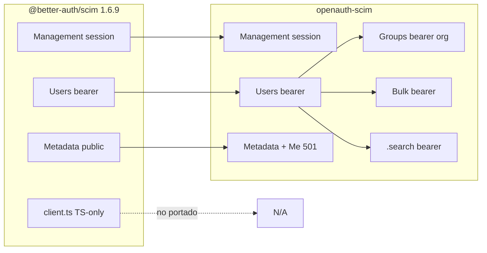

# 01 — Resumen ejecutivo

## Qué es cada lado

| | Better Auth `@better-auth/scim` | OpenAuth `openauth-scim` |
| --- | --- | --- |
| Propósito | Plugin SCIM 2.0 para provisionar **usuarios** vía IdP | Mismo rol + Groups (teams), Bulk, búsqueda RFC, ETags |
| Montaje | Dentro del handler `better-auth` (`/api/auth/...`) | Plugin `scim(ScimOptions)` en `OpenAuth` |
| Referencia RFC | 7643/7644 (Users + metadata) | 7643/7644 ampliado donde IdPs lo exigen |
| Estado producto | Estable en ecosistema BA | Beta experimental en OpenAuth |

## Alcance de esta documentación

**Incluido**

- Comportamiento HTTP observable (management + `/scim/v2/*`).
- Modelo `scimProvider`, tokens bearer, aislamiento provider/org.
- Tests y qué escenario cubren.
- Decisiones de diseño server-side (seguridad, Rust, server-only).

**Excluido (no es gap de paridad server)**

- `@better-auth/scim/client` y registro TypeScript `BetterAuthPluginRegistry`.
- Dashboard / Better Auth Infra UI para conectar SCIM.
- Vitest, `tsdown`, OpenAPI `HIDE_METADATA` como producto (solo nota).
- Tests E2E del monorepo BA que montan `@better-auth/sso` salvo donde afectan fixtures de sesión.

## Mapa mental de paridad

## Conclusión en una tabla

| Categoría | Cantidad aprox. |
| --- | --- |
| Rutas con paridad directa upstream | 17 |
| Rutas adicionales OpenAuth | 9 |
| Rutas TS-only (client) | 0 HTTP (solo tipos) |
| Tests upstream | ~87 |
| Tests OpenAuth | ~189 |
| Tests que cubren escenario upstream | ~75 declaraciones `it` mapeadas |
| Tests solo OpenAuth | ~100+ (groups, bulk, adapters, ETag, etc.) |

## Dónde vive la lógica

| Concern | Upstream | OpenAuth |
| --- | --- | --- |
| Registro plugin | `src/index.ts` | `src/lib.rs` |
| Rutas HTTP | `src/routes.ts` (~1340 líneas) | `src/routes.rs` + `src/routes/*.rs` |
| Bearer auth | `src/middlewares.ts` | `src/routes/auth_context.rs` |
| Tokens | `src/scim-tokens.ts` | `src/token.rs` + `auth_context.rs` |
| Filtros | `src/scim-filters.ts` | `src/filters.rs` |
| PATCH | `src/patch-operations.ts` | `src/patch.rs` |
| Recursos JSON | `src/scim-resources.ts` | `src/resources.rs` |
| Metadata | `user-schemas.ts`, `routes.ts` (inline config) | `src/metadata.rs` |
| Errores SCIM | `src/scim-error.ts` | `src/errors.rs` |
| Store providers | inline en `routes.ts` | `src/store.rs` |
| Schema DB | plugin `schema.scimProvider` | `src/schema.rs` (3 tablas) |

## Siguiente lectura

- Detalle archivo a archivo: [02-package-mapping.md](./02-package-mapping.md)
- Rutas y auth: [03-endpoints.md](./03-endpoints.md)
- Tests: [06-tests.md](./06-tests.md)
