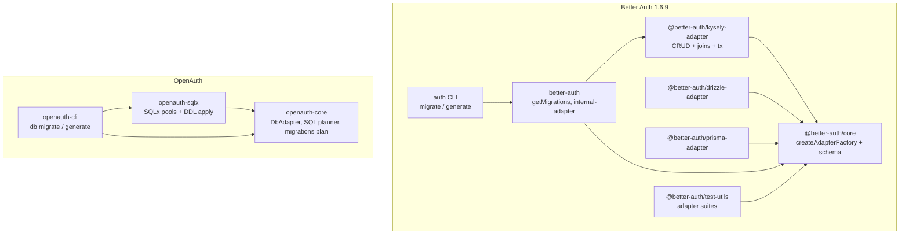

# Package mapping: openauth-sqlx ↔ Better Auth

Better Auth splits database concerns across several npm packages. OpenAuth
consolidates the **Kysely SQL path** into one optional crate plus shared core.

## High-level architecture

## Crate ↔ package matrix

| OpenAuth | Upstream package(s) | Notes |
| --- | --- | --- |
| `openauth-core::db` | `@better-auth/core` (`db/adapter`, `db/schema`) | Trait contract, query types, `plan_schema_migration`, `SqlDialect`, rate-limit SQL |
| `openauth-sqlx` | `@better-auth/kysely-adapter` + `better-auth/src/db/get-migration.ts` | SQL **execution** + catalog introspection + additive DDL |
| `openauth` feature `sqlx` | `better-auth` default DB wiring (`adapter-kysely.ts`) | Re-exports `openauth_sqlx` as `openauth::sqlx` |
| `openauth-cli` `db migrate` | `packages/cli/src/commands/migrate.ts` | OpenAuth supports SQLx adapters; upstream migrate is **Kysely-only** |
| `openauth-cli` `db generate` | `packages/cli/src/generators/{kysely,prisma,drizzle}.ts` | OpenAuth generate targets SQL/schema files for SQLx path |
| (no crate) | `@better-auth/drizzle-adapter` | ~886 LOC; separate ORM |
| (no crate) | `@better-auth/prisma-adapter` | Prisma Client bridge |
| (no crate) | `@better-auth/mongo-adapter` | Document DB |
| `openauth-core` memory adapter | `@better-auth/memory-adapter` | Dev/tests |
| `openauth-tokio-postgres` / `openauth-deadpool-postgres` | Kysely Postgres only | Alternate drivers, same `DbAdapter` |

## Responsibility split (where logic lives)

| Concern | Upstream location | OpenAuth location |
| --- | --- | --- |
| Adapter trait / factory hooks | `packages/core/src/db/adapter/factory.ts` | `crates/openauth-core/src/db/factory.rs`, `adapter/traits.rs` |
| SQL generation (SELECT/WHERE/JOIN) | Kysely adapter + factory | `openauth-core/src/db/sql/` |
| Connection pools / drivers | `kysely-adapter/src/dialect.ts`, dialect files | `openauth-sqlx/src/{sqlite,postgres,mysql}/` |
| Row ↔ value mapping | `kysely-adapter.ts` | `openauth-sqlx/src/*/row.rs`, `query.rs` |
| Schema snapshot / introspection | `get-migration.ts` (per dialect) | `openauth-sqlx/src/*/schema.rs` |
| Migration plan types | Implicit in `getMigrations` return | `openauth_core::db::SchemaMigrationPlan` + `openauth_sqlx::migration` re-exports |
| Rate limit persistence | Kysely + core schema | `*RateLimitStore` in each dialect `mod.rs` |
| Cross-adapter contract tests | `@better-auth/test-utils` | `openauth_core::db::adapter_harness` |

## File count comparison (reference implementation vs executor)

| Area | Upstream (approx.) | `openauth-sqlx` |
| --- | --- | --- |
| Kysely adapter + dialect helpers | ~1,900 LOC TS (`kysely-adapter/`) | ~2,400 LOC Rust (3× dialect modules) |
| Migrations | ~570 LOC (`get-migration.ts`) | Planning in **core**; apply in `*/schema.rs` |
| Package-local tests | 1 smoke test in kysely-adapter | 80 integration `#[tokio::test]` + shared harness |
| Full adapter contract (e2e) | `e2e/adapter/test/kysely-adapter/` (~7 test-utils suites × DB) | `run_adapter_contract` only (subset of `basic.ts`) |

OpenAuth intentionally **moves SQL planning into `openauth-core`** so
`openauth-tokio-postgres` and `openauth-deadpool-postgres` reuse the same plans.

## Public API mapping

| Upstream (Kysely path) | OpenAuth (`openauth-sqlx`) |
| --- | --- |
| `kyselyAdapter(db, config?)` | `SqliteAdapter::new` / `PostgresAdapter::new` / `MySqlAdapter::new` |
| `createKyselyAdapter(config)` | `::connect(url)` on each adapter (pool + optional `PRAGMA`) |
| `getMigrations(config)` → `{ toBeCreated, toBeAdded, runMigrations, compileMigrations }` | `plan_migrations`, `compile_migrations`, `run_migrations` / `create_schema` on adapter |
| Adapter id `"kysely"` | `"sqlx-sqlite"`, `"sqlx-postgres"`, `"sqlx-mysql"` |
| `getMigrations` warnings (log only) | `SchemaMigrationPlan::warnings` + **hard stop** via `ensure_executable_migration_plan` |

## Databases supported

| Engine | Upstream Kysely | `openauth-sqlx` feature |
| --- | --- | --- |
| SQLite | yes (better-sqlite3, Bun, node:sqlite, D1) | `sqlite` (default) |
| PostgreSQL | yes | `postgres` |
| MySQL | yes | `mysql` |
| MSSQL | yes | **no** |
| MongoDB | mongo-adapter | **no** (different crate if ever) |

## CLI behavior comparison

| Command | Upstream `auth` CLI | OpenAuth CLI |
| --- | --- | --- |
| `migrate` | Requires built-in Kysely adapter (`db.id === "kysely"`) | Works with configured SQLx adapter URLs in project config |
| `migrate` + Prisma/Drizzle | Prints guidance to use ORM migrate | Same conceptual split — SQLx path only for runtime migrate |
| `generate` | Emits Kysely / Prisma / Drizzle artifacts | Emits SQL / schema for OpenAuth `DbSchema` |
